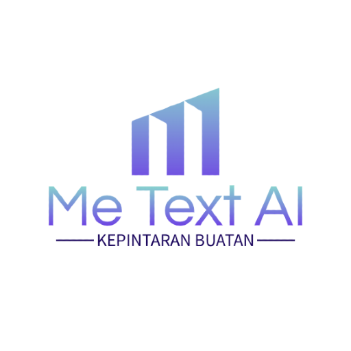

# Me Text AI
Adalah kepintaran buatan untuk membantu memudahkan manusia agar dapat menulis teks dari kamera maupun suara.

# Logo
[](https://cusmedroid.github.io/me-text-ai/assets/logo/ic_launcher_metextai_round.png) [](https://cusmedroid.github.io/me-text-ai/assets/logo/ic_launcher_metextai.png)

# Muat
> [Lib Tesseract](https://tesseract.projectnaptha.com)

> [Speech To Text](https://www.tutorialspoint.com/how-to-convert-speech-to-text-using-javascript)

# Meta
``` txt

              Pengguna
                 |
     ---------------------------
    |                           |
  Tombol                      Tombol
  Kamera                      Suara
    |                           |
 antarmuka                   antarmuka
 Kamera > Teks               Suara > Teks

```

# Dasar Bahasa Teks AI
- English
- Indonesia (I don't think so)

# Android
1. > [WebView Camera](https://cusmedroid.github.io/me-text-ai/camera/)
2. > [WebView Voice](https://cusmedroid.github.io/me-text-ai/voice/)
2. > [WebView Application Letter](https://cusmedroid.github.io/me-text-ai/application-letter/)
2. > [WebView Current Location](https://cusmedroid.github.io/me-text-ai/current-location/)

# Tangkapan Layar Aplikasi Android
[](https://cusmedroid.github.io/me-text-ai/assets/img/ss_phone_01.png) [](https://cusmedroid.github.io/me-text-ai/assets/img/ss_phone_02.png) [](https://cusmedroid.github.io/me-text-ai/assets/img/ss_phone_03.png) [](https://cusmedroid.github.io/me-text-ai/assets/img/ss_phone_04.png)

# Sematkan
``` html
<!-- Camera -->
<iframe border="0" src="https://cusmedroid.github.io/me-text-ai/camera/"></iframe>
<!-- Voice -->
<iframe border="0" src="https://cusmedroid.github.io/me-text-ai/voice/"></iframe>
```

# Tangkapan Layar Web
[](https://cusmedroid.github.io/me-text-ai/assets/img/ss_01.jpg) [](https://cusmedroid.github.io/me-text-ai/assets/img/ss_02.jpg) [](https://cusmedroid.github.io/me-text-ai/assets/img/ss_03.jpg) [](https://cusmedroid.github.io/me-text-ai/assets/img/ss_04.jpg)

# Rilis
[Tahap Pertumbuhan]()
